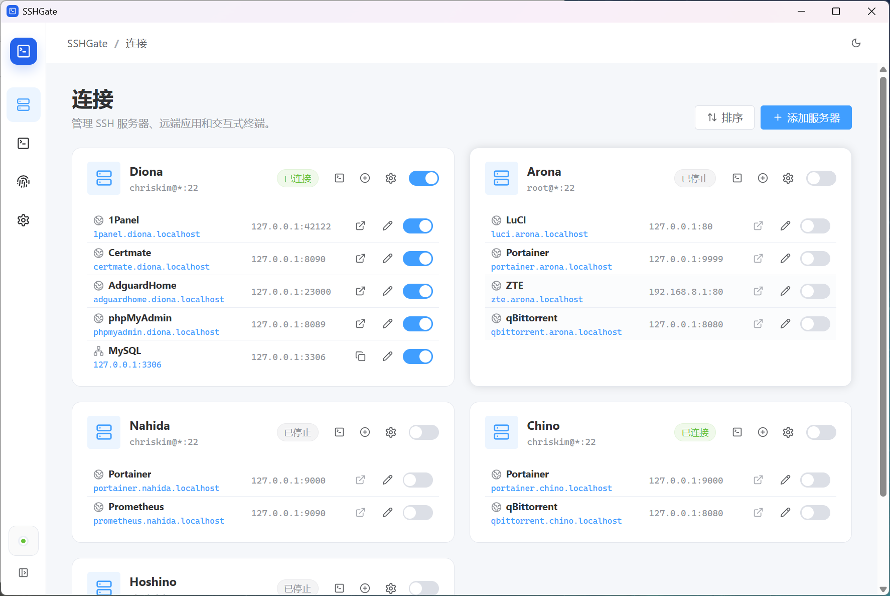

# SSHGate

SSHGate 是一个带**图形界面**的 SSH 端口转发工具。它通过 **SSH 端口映射**访问远端服务，并由本地**反向代理**将服务映射为易记的 `*.localhost` 地址。



主要功能：

- 管理多个 SSH 服务器和远端应用
- 使用 `应用名.服务器名.localhost` 访问远端 Web 服务
- 支持 HTTP 流式响应和 WebSocket
- 提供多标签交互式 SSH 终端
- 支持应用启停、连接恢复和配置导入导出

## 使用

1. 在连接页添加 SSH 服务器，选择密钥或密码认证。
2. 为服务器添加应用，填写远端主机和端口。
3. 启动应用，通过生成的 `*.localhost` 地址访问远端服务。
4. 如需命令行操作，可从服务器卡片打开终端。

本地反向代理默认监听 `127.0.0.1:80`。端口被占用时，可在设置页修改监听端口；使用非 80 端口时，访问地址会自动附加端口号。

## 安全

- 本地代理默认只监听回环地址，不对局域网或公网开放。
- 首次连接保存 SSH 主机密钥指纹，指纹变化时拒绝连接。
- 配置文件只保存私钥路径，不复制或保存私钥内容。
- 密码和私钥口令默认只在当前运行期间使用，选择记住后保存到**系统凭据库**。
- 导出的应用 Config 不包含密码或私钥口令。

## 实现

桌面端基于 Tauri 2、Vue 3 和 Element Plus。Rust 后端使用 `russh` 与 Tokio 管理 SSH 会话，通过 SSH `direct-tcpip` channel 转发远端流量，并以内置 HTTP 反向代理按 `.localhost` 域名路由请求。同一服务器的应用和终端复用 SSH 会话，终端界面由 xterm.js 提供。

## 开发

需要 Node.js 20+、Rust 1.85+，以及 [Tauri 2 平台依赖](https://v2.tauri.app/start/prerequisites/)。

安装依赖并启动开发模式：

```bash
npm install
npm run tauri dev
```

检查前端：

```bash
npm run build
```

检查后端：

```bash
cargo check --manifest-path src-tauri/Cargo.toml
cargo test --manifest-path src-tauri/Cargo.toml
```

构建发布版本：

```bash
npm run tauri build
```

仅构建可执行文件，不生成安装包：

```bash
npm run tauri build -- --no-bundle
```

## 贡献

该项目**几乎处处**由 Codex 完成，因此接受任何形式的贡献，欢迎提交 PR 或 Issues。